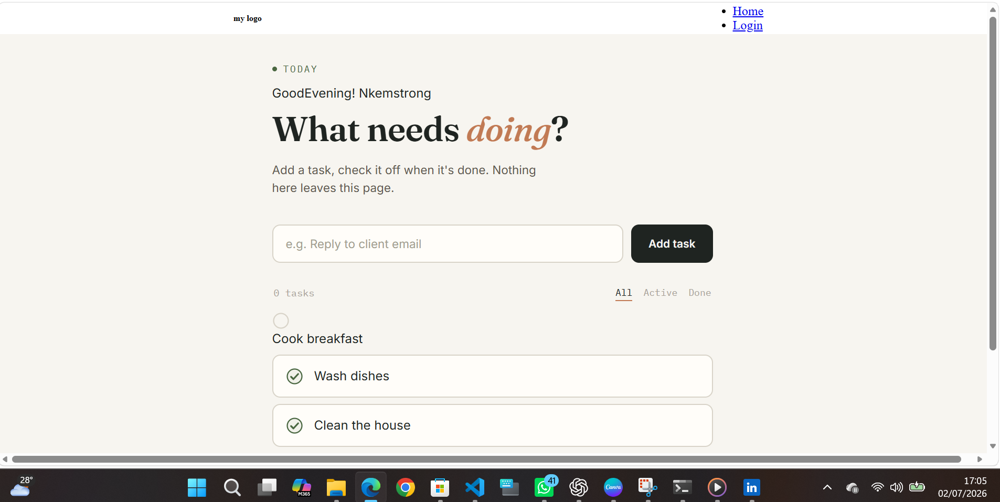

# ✅ Django To-Do List Application

A simple and responsive To-Do List web application built with **Python** and **Django**.

## 📸 Screenshots

### Home Page



---

## 🚀 Features

- Add new tasks
- Edit existing tasks
- Delete tasks
- Mark tasks as completed
- Responsive design
- Django Admin
- SQLite Database

---

## 🛠 Technologies Used

- Python
- Django
- HTML5
- CSS3
- SQLite
- Git
- GitHub

---

## ⚙ Installation

Clone the repository

```bash
git clone https://github.com/Nkemstrong/django-todo-app.git
```

Install dependencies

```bash
pip install -r requirements.txt
```

Run migrations

```bash
python manage.py migrate
```

Run the server

```bash
python manage.py runserver
```

---

## 📚 What I Learned

This project helped me understand:

- Django Models
- CRUD Operations
- Django Templates
- URL Routing
- Forms
- Template Inheritance
- Git & GitHub

---

## 👨‍💻 Author

**Nkem Gospel**

Biomedical Scientist | Python Backend Developer | Data Scientist

GitHub:
https://github.com/Nkemstrong

LinkedIn:
https://www.linkedin.com/in/nkem-gospel-5b9206260